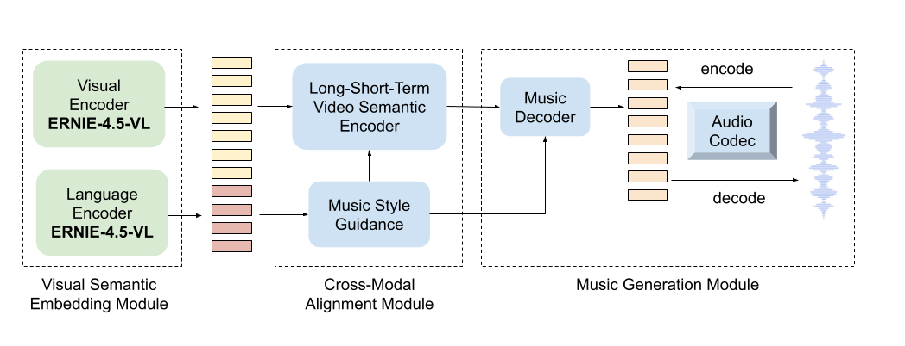

# 🎶 RhythmAI: AI-Powered Artistic Background Music Generation

RhythmAI is an enhanced background music (BGM) generation project that leverages advanced Video Language Models (VLM) for richer, more artistic music descriptions.

This project is an adaptation and enhancement of the original [MMAudio repository](https://github.com/hkchengrex/MMAudio), focusing on delivering high-quality, context-aware artistic music generation.

The repository contains the complete backend server codebase and the core music generation logic. Our web-based frontend application is served separately at: https://rhythm-ai-suite.lovable.app

## ✨ Key Enhancement: VLM-Enhanced BGM Description

Our core innovation lies in the integration of the powerful **ERINE-4.5-VL** model. This **Video Understanding and Creative Description Generation** capability is used to analyze the input video and generate a sophisticated, artistic description of the *desired background music*.

This deep contextual understanding significantly enhances the quality and relevance of the music output compared to the base model, moving beyond simple genre matching to truly creative BGM generation.



## 🎥 Demo

See RhythmAI in action! The videos below (note: **only the audio** is generated by RhythmAI; the video content itself is generated by Sora 2) showcase the quality of our music.

- [Video link on the way]

## 🚀 Getting Started

Follow these steps to set up and run the RhythmAI backend server.

**1. Setup**

Navigate into the repository directory and prepare your Python environment:

```bash
# Create and activate a virtual environment (recommended)
# python -m venv venv
# source venv/bin/activate 

# Install required dependencies
pip install torch torchvision torchaudio torchcodec ffmpeg
pip install -e .
```

**2. Configuration**

The server requires several credentials for the Video Language Model (VLM) and database persistence (Supabase).

Create a file named **`.env`** in your root directory with the following configuration:

```bash
# Credentials for the Video Language Model (VLM)
API_KEY={VLM API KEY}
BASE_URL={VLM endpoint}

# Credentials for Supabase (used for job status and data storage)
SUPABASE_URL=https://xxx.supabase.co
SUPABASE_KEY={supabase service role key}
```

**3. Running the Server**

Start the application server:

```bash
python server.py
```

The server will be ready to accept requests once initialization is complete. Please allow **1-2 minutes** for the server to warm up the necessary models.

## 🌐 Server API Endpoints

The following RESTful endpoints are available for interacting with the BGM generation service.

- **Generate BGM (`POST /api/v1/gen`)**

Initiates a new background music generation job.

| Parameter           | Type | Description                                 |
| ------------------- | ---- | ------------------------------------------- |
| `video_url` | `string` | URL of the input video (e.g., `"xxx.mp4"`). |
| `user_request` | `string` | **Optional** brief description or mood for the BGM (**must be blank `""`** if no description is provided). |

**Returns:** A JSON object containing the `job_id` to track the process.

- **Query Job Status (`GET /api/v1/job/{job_id}`)**

Retrieves the current status and results of a specific generation job.

**Path Parameter:** `job_id` (The UUID returned from `/api/v1/gen`).

**Response (In Progress):**

```json
{ 
  "job_id": "uuid...", 
  "status": "processing",
  "completed_count": 0,
  "total_count": 3, 
  "results": [ ], 
  "error": null 
}
```

**Response (Completed):**

```json
{ 
  "job_id": "uuid...",
  "status": "completed",
  "completed_count": 2, 
  "total_count": 3,
  "results": [
    {
      "prompt": "Upbeat electronic music with...",
      "audio_url": "https://...audio1.flac", 
      "index": 0 
    },
    { 
      "prompt": "Upbeat electronic music featuring...",
      "audio_url": "https://...audio2.flac",
      "index": 1 
    }
  ],
  "error": null 
}
```

- **Merge Video and Audio (`POST /api/v1/merge`)**

A utility endpoint to combine a video URL with a generated audio track.

| Parameter   | Type     | Description                                      |
| ----------- | -------- | ------------------------------------------------ |
| `video_url` | `string` | URL of the input video (e.g., `"xxx.mp4"`).      |
| `audio_url` | `string` | URL of the generated audio (e.g., `"xxx.flac"`). |

**Returns:** A JSON object containing the merged `video_url`.

- **Ping (`GET /api/v1/ping`)**

A simple health check to ensure the server is running.
